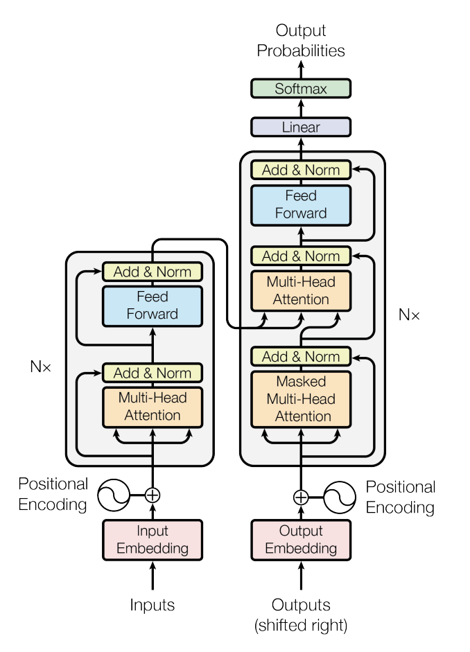
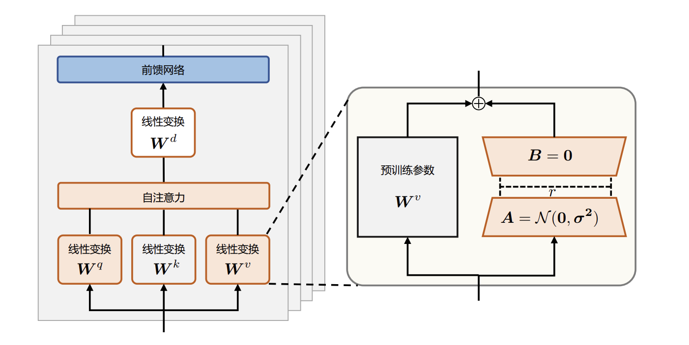
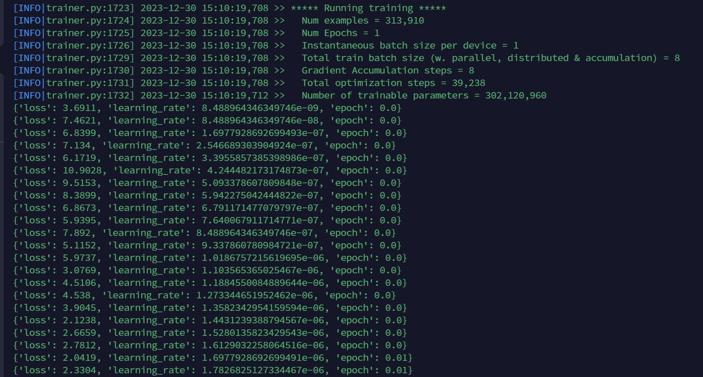
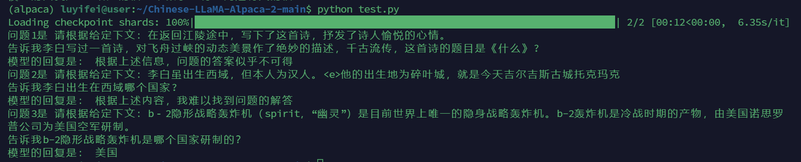

##                    《自然语言处理》大作业技术报告   

## 1、实验简介

**选题：《基于  https://github.com/hiyouga/LLaMA-Factory 开源项目跑通一个Chat机器人》**

**选择的是方向1：**尝试对模型进行简单的指令微调，数据集可以是自己构造的、可以是开源的；

**Github代码仓库：**https://github.com/LimOkii/nlp_lab


### 1.1 任务简介

​	    本次大作业我想微调出一个`LLM`，使之能够判断给定的语料是否能解答用户问题，不能编造答案。如果根据所有的内容都无法得出明确的结论，需要回复“对不起，根据参考资料无法回答“这些类似的回答。

​	    本次微调的基座采用Meta发布的`LLaMa-2-hf-7b-chat`版本，训练`LLM`在给定上下文无法回答用户问题时拒绝回答的能力，而不是胡说。

**微调代码参考：**https://github.com/ymcui/Chinese-LLaMA-Alpaca-2

### 1.2  数据集介绍

- 本次微调采用的数据集是百度发布的`WebQA`

```txt
链接: https://pan.baidu.com/s/1pLXEYtd 密码: 6fbf

文件列表：
WebQA.v1.0/readme.txt
WebQA.v1.0/me_test.ann.json （一个问题只配一段材料，材料中有答案）
WebQA.v1.0/me_test.ir.json （一个问题配多段材料，材料可能有也可能没有答案）
WebQA.v1.0/me_train.json （混合的训练语料）
WebQA.v1.0/me_validation.ann.json （一个问题只配一段材料，材料中有答案）
WebQA.v1.0/me_validation.ir.json （一个问题配多段材料，材料可能有也可能没有答案）

test跟validation的区别是，理论上来说，validation的分布跟train的分布更加接近。一般而言，validation用来验证模型的精确度，test用来验证模型的迁移能力。ann与ir的区别是，因为ir给每个问题配置了多段材料，可以通过各段材料投票来得到更加可靠的答案；而ann则是一问一材料的形式，是真正考验阅读理解能力的测试集。
```


- `me_train.jsons`数据样例如下：

```json
"Q_TRN_005637": {
    "question": "世界上最早的报纸诞生于",
    "evidences": {
        "Q_TRN_005637#00": {
            "answer": [
                "no_answer"
            ],
            "evidence": "1、十月革命胜利,世界上出现了第一个社会主义国家.一个崭新的社会主义报刊体系在苏俄确立形成.<e>2、二战结束后,又有欧、亚、拉美一系列国家脱离了资本主义体系,走社会主义道路,社会主义报业得到很大发展.<e>3、“苏东”剧变后,这些国家的报业结构和性质发生了重大变化.<e>十六、苏联时期报刊体制的主要特征是怎样的?<e>1、苏联的报刊,都属于国家所有,是党和国家机构的重要组成部分；其基本职能是集体的宣传员、集体的鼓动员和集体的组织者.<e>2、苏联的各级报刊绝对服从于各级党委的领导.<e>3、苏联报纸信息来源单一,言论高度集中.<e>4、苏联报刊在建设时期是社会主义建设的工具.<e>十七、发展中国家报业又何共同特点?<e>1、早期报刊、尤其是报业发端较早的国家的早期报刊,大多是殖民者创办的；<e>2、随着反殖民主义反封建斗争的开展,这些国家的民族报刊逐步发展起来,并推动了反殖民主义反封建斗争的进程。
        },
        ………
        …………
        "Q_TRN_005637#03": {
            "answer": [
                "中国"
            ],
            "evidence": "北宋末年(公元11,12世纪)出现的印刷报纸,不仅是中国新闻史上最早的印刷报纸,也是世界新闻史上最早的印刷报纸.中国新闻事业历史的悠久,内容的丰富,是任何西方国家都难以比肩的.<e>中国古代的报纸产生于中国的封建社会时期,是封建地主阶级及其政治代表占统治地位的封建自然经济通过新闻手段的反映.在漫长的封建社会时期,中国古代的报纸,不论是官方的邸报,还是民办的小报和京报,都必然要和当时的封建统治者保持一定的联系.<e>中国古代的邸报有1200年左右的历史.小报有近千年的历史.民间报房出版的邸报,京报有近400年的历史.它们从诞生到结束,持续的时间都不算短,但发展不快,形式内容的变化不大."
        },
        "Q_TRN_005637#04": {
            "answer": [
                "no_answer"
            ],
            "evidence": "因此，一般认为，世界上最早的报纸诞生在1609年。"
        },
        "Q_TRN_005637#05": {
            "answer": [
                "中国"
            ],
            "evidence": "报纸从诞生到今天已经走过了漫长的历史，公元前60年，古罗马政治家恺撒把罗马市以及国家发生的时间书写在白色的木板上，告示市民。这便是世界上最古老的报纸。中国在7世纪，唐朝宫廷内就发行过手写的传阅版，这应该算是中国最早的报纸。"
        },
        "Q_TRN_005637#06": {
            "answer": [
                "中国"
            ],
            "evidence": "最早的写在纸上的报纸和印刷在纸上的报纸都诞生于中国.唐玄宗开元年间(公元713年--742年)出现的开元杂报,不仅是中国新闻史上最早的报纸,也是世界新闻史上最早的报纸."
        },
        "Q_TRN_005637#09": {
            "answer": [
                "no_answer"
            ],
            "evidence": "答：1566年,世界最早的印刷报纸《威尼斯新闻》诞生于1566年的意大利威尼斯邸报》是我国在世界上发行最早，时间最久的报纸。"
        }
    }
}
```

​        这个数据集非常适合做给定上下文的回答问题，`evidence`即是输入给模型的上下文，`question`则是用户提出的问题，模型需要根据给定的`evidence`以及`question`回答`no_answer`或者是答案。

## 2、基座模型LLaMa介绍

 本次微调的基座模型采用Meta发布的`LLaMa-2-hf-7b-chat`版本



`LLaMa2` 和 `LLaMa` 的模型结构基本一致，共用了 32 个 `decoder` 层。其中每个 `decoder` 层如上图右半部分所示，`LLaMa2` 主要是将 `Transformer` 中的 `Layer Norm` 换成了 `RMS Norm`，`Multi-Head Attention` 换成了 `GQA`（``LLaMa` 是 `MQA`）, `Positional Encoding `换成了 `Rotary Encoding`（`RoPE` 旋转位置编码），在前馈神经网络（`FFN`） 使用 `SwiGLU` 激活函数替换了 `Transformer` 中的 `ReLU` 激活函数。

 

## 3、实验步骤

### 3.1 数据预处理

本次微调代码参考的`Chinese-LLaMA-Alpaca-2`，指令微调数据格式为`Stanford Alpaca`：

```json
[
  {"instruction" : ...,
   "input" : ...,
   "output" : ...},
  ...
]
```

需要对`WebQA`数据集做转换，因此编写了脚本 `convert_data_to_llama_train.py`

`instruction`："请根据给定下文：" +  "evidence" +  '\n'  +  "告诉我"  +  "question" + '\n'

`input`: ""

`output`："answer"

- 为了让模型无法回答的输出多样化，如果答案为`no_answer`,则从以下模板中随机选择一句回答


```python
# 无法回答时，模型给出的回答样例
cant_answer_template = [
    '抱歉，根据您所给的内容，我无法找到有关问题的答案',
    '给定的信息中似乎没有提到问题的答案',
    '根据提供的内容，我无法找到问题的相关信息',
    '根据您提供的上下文，我找不到与问题相关的答案',
    '给定的信息中似乎没有与问题有关的信息',
    '根据上述内容，我难以找到问题的解答',
    '据我所知，问题的答案不在提供的信息中',
    '根据上述信息，问题的答案似乎不可得',
    '给定的上下文似乎没有包含问题的答案',
    '给定的信息中似乎没有与问题有关的线索'
]
```

- 最终转换后的训练数据样例如下：

```json
[
    {
        "instruction": "请根据给定下文：1、十月革命胜利,世界上出现了第一个社会主义国家.一个崭新的社会主义报刊体系在苏俄确立形成.<e>2、二战结束后,又有欧、亚、拉美一系列国家脱离了资本主义体系,走社会主义道路,社会主义报业得到很大发展.<e>3、“苏东”剧变后,这些国家的报业结构和性质发生了重大变化.<e>十六、苏联时期报刊体制的主要特征是怎样的?<e>1、苏联的报刊,都属于国家所有,是党和国家机构的重要组成部分；其基本职能是集体的宣传员、集体的鼓动员和集体的组织者.<e>2、苏联的各级报刊绝对服从于各级党委的领导.<e>3、苏联报纸信息来源单一,言论高度集中.<e>4、苏联报刊在建设时期是社会主义建设的工具.<e>十七、发展中国家报业又何共同特点?<e>1、早期报刊、尤其是报业发端较早的国家的早期报刊,大多是殖民者创办的；<e>2、随着反殖民主义反封建斗争的开展,这些国家的民族报刊逐步发展起来,并推动了反殖民主义反封建斗争的进程；十八、新闻通讯社是在怎样的背景下诞生的?它的功能与作用如何?\n告诉我世界上最早的报纸诞生于\n",
        "input": "",
        "output": "给定的上下文似乎没有包含问题的答案"
    },
    {
        "instruction": "请根据给定下文：1566年,世界最早的印刷报纸《威尼斯新闻》诞生于1566年的意大利威尼斯\n告诉我世界上最早的报纸诞生于\n",
        "input": "",
        "output": "给定的信息中似乎没有与问题有关的信息"
    }
]
```


### 3.2 微调训练

#### 3.2.1 LoRA介绍

由于大语言模型参数量十分庞大，当将其应用到下游任务时，微调全部参数需要相当高的算力。为了节省成本，研究人员提出了多种参数高效`（Parameter Efficient）`的微调方法，旨在仅训练少量参数使模型适应到下游任务。本项目使用`LoRA(Low-Rank Adaptation of Large Language Models)`进行模型微调。`LoRA `方法 可以在缩减训练参数量和 `GPU` 显存占用的同时，使训练后的模型具有与全量微调相当的性能。

研究表明，语言模型针对特定任务微调之后，权重矩阵通常具有很低的本征秩 `（Intrinsic Rank）`。研究人员认为参数更新量即便投影到较小的子空间中，也不会影响学习的有效性。因此，提出固定预训练模型参数不变，在原本权重矩阵旁路添加低秩矩阵的乘积作为可训练参数，用以模拟参数的变化量。具体来说，假设预训练权重为${w_0\ \epsilon \ \mathbb{R}^{d*k}}$，可训练参数为${\varDelta W\ =\ BA}$，其中${B\ \epsilon \ \mathbb{R}^{d*r} }$，${A\ \epsilon \ \mathbb{R}^{r*d}}$，初始化时，矩阵 ${A}$ 通过高斯函数初始化，矩阵${B}$ 为零初始化，使得训练开始之前旁路对原模型不造成影响，即参数改变量为 0。对于该权重的输入 ${x}$ 来说，输出为式${h\ =\ W_0x+∆W\ x\ =W_0x+BAx}$，`LoRA`算法结构方法如图：





除 `LoRA` 之外，也其他高效微调方法，如微调适配器`（Adapter）`或前缀微调`（Prefix Tuning）`。 适配器方法分别对 `Transformer `层中的自注意力模块与多层感知`（MLP）`模块，在其与其之后的残差连接之间添加适配器层`（Adapter layer）`作为可训练参数，该方法及其变体会增加网络的深度，从而在模型推理时带来额外的时间开销。当没有使用模型或数据并行时，这种开销会较为明显。而对于使用 `LoRA `的模型来说，由于可以将原权重与训练后权重合并，即 ${W\ =\ W_0\ +\ BA}$， 因此在推理时不存在额外的开销。前缀微调是指在输入序列前缀添加连续可微的软提示作为可训练参数。由于模型可接受的最大输入长度有限，随着软提示的参数量增多，实际输入序列的最大长度也会相应减小，影响模型性能。这使得前缀微调的模型性能并非随着可训练参数量单调上升。 在文献的实验中，使用 `LoRA` 方法训练的 `GPT-2`、`GPT-3`模型在相近数量的可训练参数下， 性能均优于或相当于使用上述两种微调方法。


#### 3.2.2 LoRA微调

数据共`40w+`条，其中训练数据`313910`条，其余是验证数据，在单卡`A6000 48G显存`显卡上采用LoRA方式微调。



可以看到原版`LLaMa2`是`7b`的权重,使用`LoRA`方式微调，训练参数仅为`0.3b`，为初始权重的`4%`左右，大大减少了需要训练的参数量。

在单卡`A6000 48G显存`训练一个`epoch`，约`57`个小时(包括训练时间和评估时间)，最终的`loss`从一开始的`7`左右降到了`0.1`上下。

#### 3.2.3 权重合并

手动将`LoRA`与原版`Llama-2`合并得到完整模型的流程

确保机器有足够的内存加载完整模型（例如`7B`模型需要`13-15G`）以进行合并模型操作

**Step 1: 获取原版Llama-2-hf模型**

`HF`格式模型相关文件（可以不用下载`safetensors`格式模型权重）：

```
config.json
generation_config.json
pytorch_model-00001-of-00002.bin
pytorch_model-00002-of-00002.bin
pytorch_model.bin.index.json
special_tokens_map.json
tokenizer_config.json
tokenizer.json
tokenizer.model
```

**Step 2: 合并LoRA权重，生成全量模型权重**

这一步骤会合并`LoRA`权重，生成全量模型权重。此处可以选择输出`PyTorch`版本权重（`.pth`文件）或者输出`HuggingFace`版本权重（`.bin`文件）。执行以下命令：

```git
$ python scripts/merge_llama2_with_chinese_lora_low_mem.py \
    --base_model path_to_original_llama2_hf_dir \
    --lora_model path_to_chinese_llama2_or_alpaca2_lora \
    --output_type huggingface \
    --output_dir path_to_output_dir 
    --verbose
```

参数说明：

- `--base_model`：存放`HF`格式的`Llama-2`模型权重和配置文件的目录
- `--lora_model`：中文`LLaMA-2/Alpaca-2 LoRA`解压后文件所在目录，也可使用🤗`Model Hub`模型调用名称（会自动下载）
- `--output_type`：指定输出格式，可为`pth`或`huggingface`。若不指定，默认为`huggingface`
- `--output_dir`：指定保存全量模型权重的目录，默认为`./`
- （可选）`--verbose`：显示合并过程中的详细信息


## 4、实验结果展示

```python
model = "/data0/luyifei/cant_ans_merge_weight/"
tokenizer = AutoTokenizer.from_pretrained(model)
pipeline = transformers.pipeline(
    "conversational",
    model=model,
    torch_dtype=torch.float16,
    device_map="auto",
)
question = "请根据给定下文：在返回江陵途中，写下了这首诗，抒发了诗人愉悦的心情。\n告诉我李白写过一首诗，对飞舟过峡的动态美景作了绝妙的描述，千古流传，这首诗的题目是《什么》?"
conversation = Conversation(question)
sequences = pipeline(
    conversation,
    do_sample=True,
    top_k=10,
    num_return_sequences=1,
    eos_token_id=tokenizer.eos_token_id,
    max_length=500,
)
print('问题1是',question1)
print('模型的回复是：'sequences.generated_responses[-1])
```

加载合并后的权重，3个测试样例如下：



- 例子1和例子3回答正确

- 例子2回答错误

例子1中，给定的上下文中没有关于这首诗的题目，因此模型无法回答该问题。

例子2中，给定的上下文中给出了李白的出生地为碎叶城，但是模型却回复无法回答该问题。

例子3中，给定的上下文中告知b-2轰炸机是美国空军研制，模型也能正确回复答案`美国`


## 5、总结

​		使用`LoRA`方式微调`LLaMa`，能使大模型一定程度上根据给定的上下文来回答问题。在给定上下文不包含问题的答案时能输出"对不起，我无法回答该问题"等回复，若给定上下文包含问题的答案，模型也能输出正确答案。

​		但是当我尝试更多样例测试时，发现模型更容易偏向输出无法回答的回复，即使给定上下文中有明确的问题答案。我总结的分析原因如下：

​		微调大型模型时，模型可能会倾向于输出一种相对保守的策略，即更倾向于回答无法回答的响应。这可能是因为微调过程中的数据集中，有更多的例子涉及到模型无法从给定上下文中得知答案的情况，导致模型更容易学习到这种“保守”的回答。

有几个可能的原因导致这种现象：

1. **数据分布不均衡：** 可能时微调数据中无法回答的例子相对较多，模型可能会更容易学习到输出类似于“无法回答”的响应。
2. **Loss 函数设计：** 微调过程中使用的损失函数可能也影响了模型的学习方向。如果损失函数更倾向于对无法回答的情况进行惩罚，模型可能更倾向于产生这样的输出。
3. **训练数据中的噪声：** 如果微调数据中包含了噪声或错误的标签，模型可能会过度拟合这些错误的标签，导致更多的“无法回答”响应。

​	下一步尝试的改进方向：

​	1、**检查数据质量：** 仔细检查微调数据集，确保标签和上下文对应正确，避免包含噪声或错误的信息。

​    2、**平衡数据集：** 确保微调的数据集中有足够的例子涉及到模型可以回答的情况，以及无法回答的情况，以避免数据分布不均衡。
